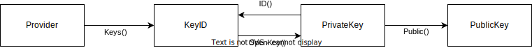

<!--
SPDX-FileCopyrightText: 2023 Steffen Vogel <post@steffenvogel.de>
SPDX-License-Identifier: Apache-2.0
-->

<div align="center" >
    

# Hardware-secured Key Establishment

[](https://github.com/cunicu/hawkes/actions)
[](https://goreportcard.com/report/github.com/cunicu/hawkes)
[](https://app.codecov.io/gh/cunicu/hawkes/tree/main)
[](https://github.com/cunicu/hawkes/blob/main/LICENSES/Apache-2.0.txt)

[](https://pkg.go.dev/github.com/cunicu/hawkes)
</div>

`hawkes` is a Go package providing a interface to establish shared secrets between two or more parties.
It includes implementations of this interface for OATH-TOTP as well as PIV, OpenPGP, PCS11 smart cards and TPM2 modules.

hawkes' main use case is the establishment of pre-shared keys for [cunīcu](https://cunicu.li), a WireGuard mesh-network, using hardware-secured or post-quantum resilient key establishment methods.

## Building

When build with `CGO_ENABLED`, hawkes requires the following external dependencies.

```bash
apt-get install \
    libpcsclite-dev
```

## Key Providers


#### `File`: Secrets stored in files / memory

Secret keys are stored in local file or memory.

⚠ Use only for testing.

#### `AppleSE`: Apple Secure Enclave

> The Secure Enclave is a hardware-based key manager that’s isolated from the main processor to provide an extra layer of security. When you protect a private key with the Secure Enclave, you never handle the plain-text key, making it difficult for the key to become compromised. Instead, you instruct the Secure Enclave to create and encode the key, and later to decode and perform operations with it. You receive only the output of these operations, such as encrypted data or a cryptographic signature verification outcome.

- **Documentation:** [Protecting keys with the Secure Enclave](https://developer.apple.com/documentation/security/certificate_key_and_trust_services/keys/protecting_keys_with_the_secure_enclave?language=objc)

#### `TPM2`: Trusted Platform Module v2 (TPM)

> Trusted Platform Module (TPM, also known as ISO/IEC 11889) is an international standard for a secure crypto processor, a dedicated micro controller designed to secure hardware through integrated cryptographic keys. The term can also refer to a chip conforming to the standard.

- **Specification:** [TPM 2.0 Library](https://trustedcomputinggroup.org/resource/tpm-library-specification/)

#### `OpenPGP`: OpenPGP Card

> The OpenPGP card is an ISO/IEC 7816-4, -8 compatible smart card that is integrated with many OpenPGP functions. Using this smart card, various cryptographic tasks (encryption, decryption, digital signing/verification, authentication etc.) can be performed. It allows secure storage of secret key material.

- **Specification:** [Functional Specification of the OpenPGP application on ISO Smart Card Operating Systems](https://www.gnupg.org/ftp/specs/OpenPGP-smart-card-application-3.4.1.pdf)

#### `PIV`: Personal Identity Verification (PIV) Card

> FIPS 201 (Federal Information Processing Standard Publication 201) is a United States federal government standard that specifies Personal Identity Verification (PIV) requirements for Federal employees and contractors. This Standard specifies the architecture and technical requirements for a common identification standard for Federal employees and contractors.[1] FIPS 201 specifies that an identity credential must be stored on a smart card.

- **Specification:** [FIPS 201-3](https://csrc.nist.gov/pubs/fips/201-3/final)

#### `PKCS11`: PKCS11 Token

> PKCS #11 is one of the Public-Key Cryptography Standards, and also refers to the programming interface to create and manipulate cryptographic tokens (a token where the secret is a cryptographic key).

- **Specification:** [PKCS #11 Cryptographic Token Interface Base Specification Version 2.40](https://docs.oasis-open.org/pkcs11/pkcs11-base/v2.40/pkcs11-base-v2.40.html)

#### `YKOATH`: Yubico's YKOATH Protocol

> The YKOATH protocol is used to manage and use OATH credentials with a YubiKey NEO, YubiKey 4, or YubiKey 5. It can be accessed over USB (when the CCID transport is enabled) or over NFC, using ISO 7816-4 commands as defined in this document.

- **Specification:** [YKOATH Protocol Specification](https://developers.yubico.com/OATH/YKOATH_Protocol.html)

## Handshake Protocols

_hawkes_ uses supports two families of handshake protocols for establishing a shared secret between two parties:

- Keyed-hash message authentication code (HMAC)
- Noise protocol framework (ECDH)

The following table gives an overview of the supported protocols for each key provider

| Provider  | Protocols  | Curve         | Hash   | Enumerate | Create | Destroy |
|:--        |:--         |:--            |:--     |:--        |:--     |:--      |
| Memory    | HMAC, ECDH | secp256r1[^1] | SHA256 | ✅ | ✅ | ✅ |
| YKOATH    | HMAC       |               | SHA256 | ✅ | ✅ | ✅ |
| AppleSE   | ECDH       | secp256r1     |        | ✅ | ✅ | ✅ |
| TPM2      | HMAC, ECDH | secp256r1     | SHA256 | ❌ | ❌ | ❌ |
| OpenPGP   | ECDH       | secp256r1     |        | ✅ | ✅ | ✅ |
| PIV       | ECDH       | secp256r1     |        | ✅ | ✅ | ✅ |
| PKCS11    | ECDH       | secp256r1     |        | ✅ | ✅ | ✅ |

### Noise Protocol Framework using Elliptic-curve Diffie-Hellman (ECDH)

> Noise is a framework for crypto protocols based on Diffie-Hellman key agreement. Noise can describe protocols that consist of a single message as well as interactive protocols.

> Elliptic-curve Diffie–Hellman (ECDH) is a key agreement protocol that allows two parties, each having an elliptic-curve public–private key pair, to establish a shared secret over an insecure channel. This shared secret may be directly used as a key, or to derive another key. The key, or the derived key, can then be used to encrypt subsequent communications using a symmetric-key cipher. It is a variant of the Diffie–Hellman protocol using elliptic-curve cryptography.

- **Specifications:** 
  - [Noise Protocol Framework](http://www.noiseprotocol.org/noise.html)
  - [SEC 2: Recommended Elliptic Curve Domain Parameters](https://www.secg.org/sec2-v2.pdf)

### OATH-TOTP using HMAC (HMAC)

> Time-based one-time password (TOTP) is a computer algorithm that generates a one-time password (OTP) that uses the current time as a source of uniqueness. As an extension of the HMAC-based one-time password algorithm (HOTP), it has been adopted as Internet Engineering Task Force (IETF) standard RFC 6238.
> TOTP is the cornerstone of Initiative for Open Authentication (OATH), and is used in a number of two-factor authentication (2FA) systems.
> HMACs can provide authentication using a shared secret instead of using digital signatures with asymmetric cryptography. It trades off the need for a complex public key infrastructure by delegating the key exchange to the communicating parties, who are responsible for establishing and using a trusted channel to agree on the key prior to communication.

- **Specification:** [RFC 6238](https://datatracker.ietf.org/doc/html/rfc6238) & [RFC 4226](https://datatracker.ietf.org/doc/html/rfc4226)

### Protocol Identifiers

_hawkes_ uses protocol identifiers to describe the handshake protocol which should be used to for establishing a shared secret.

- `Noise_<Pattern>_<Cipher>_<Hash>` for elliptic curve Diffie-Helman key exchange using the [Noise protocol framework](http://www.noiseprotocol.org/).
  - `WireGuard` is an alias for `Noise_IK_ChaChaPoly_BLAKE2s`
- `OATH-TOTP_<Hash>` for a HMAC key used to calculate an OATH-TOTP one-time password.
- `Rosenpass` for the Rosenpass post-qunatum key exchange

**Note:** Deviating from the Noise protocol framework, _hawkes_ is mainly using NIST elliptic curves for the `Noise` protocol due to increased compatibility with hardware tokens and smart cards.

## Usage

### Types



## Authors

- Steffen Vogel ([@stv0g](https://github.com/stv0g))

## License

hawkes is licensed under the [Apache 2.0](./LICENSE) license.

[^1]: [secp256r1 curve in the standard curve database](https://neuromancer.sk/std/secg/secp256r1)
